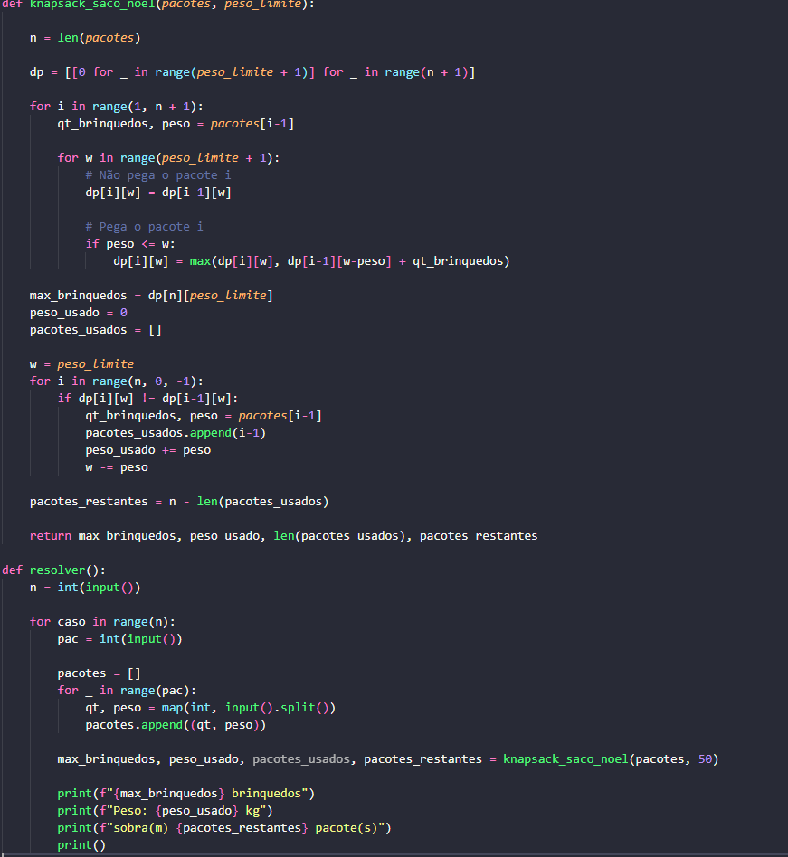
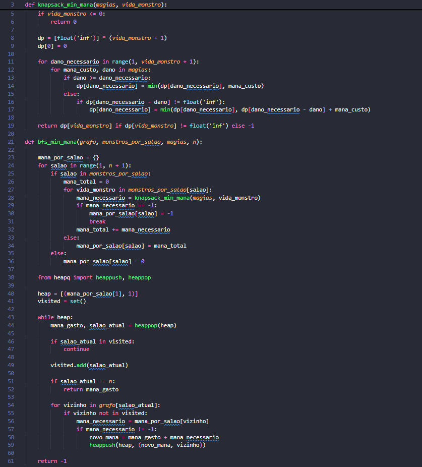
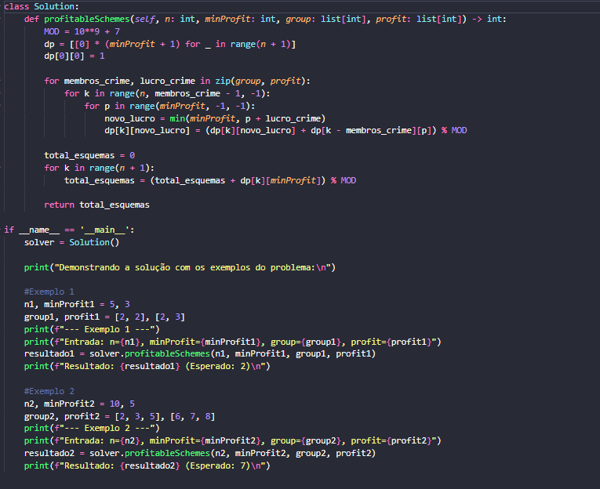

# PD_Questoes_URI

<!-- **Número da Lista**: X  -->
**Conteúdo da Disciplina**: Programação Dinâmica 

## Alunos
| Matrícula  | Aluno                               |
| ---------- | ----------------------------------- |
| 18/0015311 | Danilo Domingo Vitoriano Silva      |
| 20/0058576 | Joao Victor Marques Reis de Miranda |

## Sobre 
Este repositório foi criado para a soluções de problemas de juízes online, que são dos temas abordados na disciplina de Projeto de Algoritmos.

## Problemas Resolvidos

Tabela com os links para as devidas questões.

| Problema | Dificuldade | Método | Solução Código | Responsável                             |
| -------- | ----------- | ------ | -------------- | --------------------------------------- |
| [1409 - Zak Galou](https://judge.beecrowd.com/pt/problems/view/1409) | Difícil (9) | Knapsack | [1409.py](./solucoes/1409.py) | [Danilo](https://github.com/danilow200) |
| [1767 - Saco do Papai Noel](https://judge.beecrowd.com/pt/problems/view/1767) | Médio (5) | Knapsack | [1767.py](./solucoes/1767.py) | [Danilo](https://github.com/danilow200) |
| [879 - Profitable Schemes](https://leetcode.com/problems/profitable-schemes/description/) | Difícil | Knapsack | [879.py](./solucoes/879.py) | [Joao Victor Marques](https://github.com/jmarquees) |

## Screenshots

### 1409 - Zak Galou

### 1767 - Saco do Papai Noel

### 879 - Profitable Schemes

## Instalação 
**Linguagem**: Python 

Foi utilizado o **Python 3.13**

## Vídeo

Video de Apresentação do projeto:

  <!-- 
<a href="./assets/Trabalho_de_PA_Grafo1.mp4">Vídeo de Apresentação</a>
 -->
  
<a href="https://youtu.be/hiDeYtoYy9Y">Apresentação no YouTube</a>

